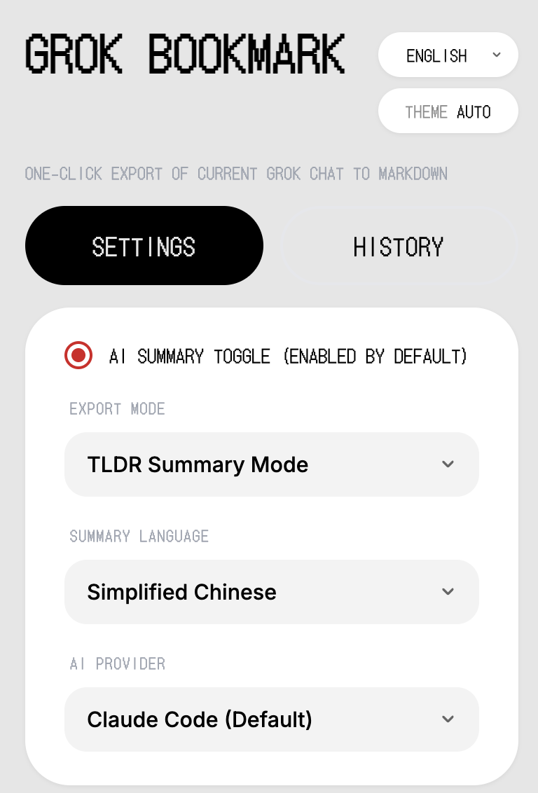
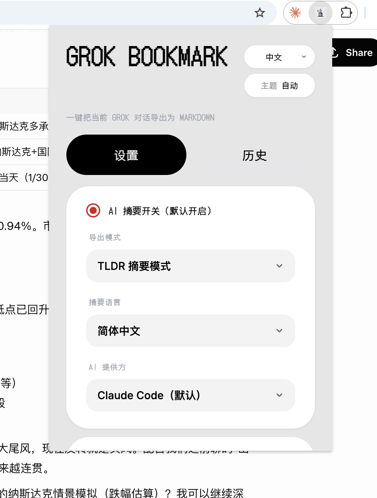

# Grok Bookmark

One-click export of [Grok](https://grok.com) conversations to well-structured Markdown files.



## English

### Features

- **One-click export** — export the current Grok conversation from the popup.
- **Two export modes** — AI-powered TLDR summary or full original conversation.
- **Structured TLDR** — `Key Points / Step-by-Step / Fact Check (1‑10) / Open Questions`.
- **Multiple AI providers** — local Claude Code (default, no API key needed), OpenAI, Anthropic Claude API, Kimi, Zhipu.
- **Multilingual summaries** — zh-CN / zh-TW / English / Japanese / Korean.
- **Custom save path** — write directly to any local folder via Native Helper, or fall back to browser Downloads.
- **Theme support** — Auto / Light / Dark for both popup and in-page export cards.
- **Export history** — browse and review past exports in the popup.
- **Deep extraction** — auto-expands collapsed content ("Show more") before export.
- **Secure storage** — API keys are encrypted with AES-256-GCM locally and never synced.

### Platform Support

> **macOS only.** The Native Helper (folder picker and local file writing) relies on macOS `osascript`. On other platforms the extension still works but falls back to browser Downloads.

### Quick Start

1. Install from [Chrome Web Store](https://chromewebstore.google.com/detail/grok-bookmark/deijjnkibjhfiimbccbfeaodcacnllpe) or load unpacked (see [Developer Install](#developer-install)).
2. Open any conversation on [grok.com](https://grok.com).
3. Click the Grok Bookmark extension icon → **Export Current Chat**.
4. The Markdown file is saved to `Downloads/grok-chat-bookmark/` by default.

That's it for basic usage. No API key or Native Helper is required for the default original-mode export.

### Native Helper Setup (Optional)

The Native Helper lets you write files directly to any local folder (instead of browser Downloads) and enables the local Claude Code AI summary provider.

**Prerequisites:** Python 3, [Claude Code CLI](https://github.com/anthropics/claude-code) (for AI summaries only).

**Option A — From the extension popup:**

1. Open the extension popup → click **One-click download install script**.
2. Run the downloaded script:

```bash
bash ~/Downloads/install-btl-native.sh
```

3. Restart browser.
4. In the popup, click **Choose Folder** to set your save directory.

**Option B — From the cloned repo (developers):**

```bash
cd grok-chat-bookmark/native-host
bash install-macos.sh <your-extension-id>
```

Find your extension ID at `chrome://extensions/` with Developer Mode enabled.

### Cloud Provider Mode

To use a cloud AI provider instead of (or without) Claude Code:

1. Enable the **AI toggle** and select **TLDR** mode.
2. Choose a provider (OpenAI / Claude / Kimi / Zhipu).
3. Enter your API Key (and optionally a custom Model or Base URL).
4. Save settings and export.

### Developer Install

1. Clone this repository:

```bash
git clone https://github.com/mingyan9989/grok-chat-bookmark.git
```

2. Open `chrome://extensions/`, enable **Developer mode**.
3. Click **Load unpacked** and select the `grok-chat-bookmark` folder.

### Security Notes

- **API keys** are encrypted with AES-256-GCM in `chrome.storage.local` and never synced to the cloud.
- **Claude Code integration**: the extension invokes the `claude` CLI to generate summaries. Claude Code follows its standard permission model and may prompt for confirmation in the terminal.
- **Native Host scope**: `grok_file_writer.py` only allows writing files under your home directory. Path traversal (`..`) is blocked.

### Known Limitations

- **DOM selectors may break**: the content script extracts conversations via CSS selectors (e.g. `[data-testid*="message"]`). If Grok changes its page structure, extraction may fail until this extension is updated.
- **macOS only** for the Native Helper. Other platforms fall back to browser Downloads.

### Project Structure

```text
grok-chat-bookmark/
├── manifest.json
├── background.js
├── content.js / content.css
├── offscreen.html / offscreen.js
├── popup.html / popup.css / popup.js
├── icons/
└── native-host/
    ├── grok_file_writer.py
    └── install-macos.sh
```

---

## 中文



### 功能特点

- **一键导出** — 在弹窗中一键导出当前 Grok 对话。
- **两种导出模式** — AI TLDR 摘要 或 完整原文。
- **结构化 TLDR** — `Key Points / Step-by-Step / Fact Check (1‑10) / Open Questions`。
- **多 AI 提供方** — 本地 Claude Code（默认，无需 API Key）、OpenAI、Anthropic Claude API、Kimi、智谱。
- **多语言摘要** — 简中 / 繁中 / English / 日本語 / 한국어。
- **自定义保存路径** — 通过 Native Helper 直接写入任意本地文件夹，或回退到浏览器下载。
- **主题支持** — 自动 / 浅色 / 深色，覆盖弹窗和页内导出卡片。
- **导出历史** — 在弹窗中浏览和回看历史导出记录。
- **深度提取** — 导出前自动展开"显示更多"等折叠内容。
- **安全存储** — API Key 使用 AES-256-GCM 本地加密，不会同步到云端。

### 平台支持

> **仅支持 macOS。** Native Helper（文件夹选择、本地文件写入）依赖 macOS `osascript`。其他平台扩展仍可使用，但会回退到浏览器下载方式。

### 快速开始

1. 从 [Chrome Web Store](https://chromewebstore.google.com/detail/grok-bookmark/deijjnkibjhfiimbccbfeaodcacnllpe) 安装，或手动加载（参见[开发者安装](#开发者安装)）。
2. 打开 [grok.com](https://grok.com) 上的任意对话。
3. 点击 Grok Bookmark 扩展图标 → **导出当前对话**。
4. Markdown 文件默认保存到 `Downloads/grok-chat-bookmark/`。

以上就是基础用法。默认的原文导出模式无需 API Key，也不需要安装 Native Helper。

### Native Helper 安装（可选）

Native Helper 可以将文件直接写入任意本地文件夹（不走浏览器下载），并启用本地 Claude Code AI 摘要。

**前置条件：** Python 3、[Claude Code CLI](https://github.com/anthropics/claude-code)（仅 AI 摘要需要）。

**方式 A — 从扩展弹窗安装：**

1. 打开扩展弹窗 → 点击 **一键下载安装脚本**。
2. 运行下载的脚本：

```bash
bash ~/Downloads/install-btl-native.sh
```

3. 重启浏览器。
4. 在弹窗中点击 **选择文件夹** 设置保存目录。

**方式 B — 从克隆的仓库安装（开发者）：**

```bash
cd grok-chat-bookmark/native-host
bash install-macos.sh <你的扩展ID>
```

扩展 ID 可在 `chrome://extensions/` 开启开发者模式后查看。

### 云模型模式

如需使用云 AI 提供方（不用 Claude Code）：

1. 开启 **AI 开关**，选择 **TLDR** 模式。
2. 选择提供方（OpenAI / Claude / Kimi / 智谱）。
3. 填写 API Key，Model / Base URL 可选。
4. 保存设置并导出。

### 开发者安装

1. 克隆本仓库：

```bash
git clone https://github.com/mingyan9989/grok-chat-bookmark.git
```

2. 打开 `chrome://extensions/`，开启 **开发者模式**。
3. 点击 **加载已解压的扩展程序**，选择 `grok-chat-bookmark` 文件夹。

### 安全说明

- **API Key**：使用 AES-256-GCM 加密后存储在 `chrome.storage.local`，不会同步到云端。
- **Claude Code 集成**：扩展调用 `claude` CLI 生成摘要。Claude Code 遵循其标准权限模型，可能会在终端中提示确认。
- **Native Host 范围**：`grok_file_writer.py` 仅允许在用户主目录下写入文件，路径遍历（`..`）会被阻止。

### 已知局限

- **DOM 选择器可能失效**：content script 通过 CSS 选择器（如 `[data-testid*="message"]`）提取对话。如果 Grok 更新页面结构，提取可能失败，需等待扩展更新适配。
- **仅 macOS** 支持 Native Helper。其他平台回退到浏览器下载。

### 项目结构

```text
grok-chat-bookmark/
├── manifest.json
├── background.js
├── content.js / content.css
├── offscreen.html / offscreen.js
├── popup.html / popup.css / popup.js
├── icons/
└── native-host/
    ├── grok_file_writer.py
    └── install-macos.sh
```
